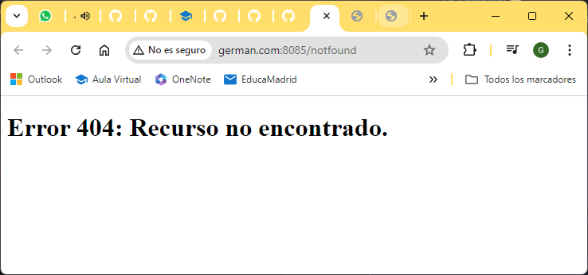

### Despliegue Web en Apache Server
## Objetivo
El objetivo requerido es la creación de tres hosts virtuales en un servidor Apache dentro de un contenedor Docker. Cada host debe alojar su propia web:
- Virtual Host 1 (```nombre.com```): Página con nuestro nombre, y una página con una personalización de la página de error 404 

- Virtual Host 2(```www.apellidos.com```): Página con nuestros apellidos y personalización de la página de error 404 

- Virtual Host 3 (```https://seguro.net```): Página con acceso restringido y personalización de las páginas de error: 404, 500, 401 y 403 
    Los datos de acceso serán: 
    - user: nuestro nombre
    - pass: nuestro apellido

## Proceso
1. Creamos un directorio **conf** y copiamos los ficheros de configuración apache2.conf y ports.conf. \
    

De estos dos ficheros no tenemos que cambiar nada de lo que viene por defecto. Este es el contenido del fichero **ports.conf**.


Cada host virtual tendrá su fichero de configuración, en el directorio sites-available, que obtendremos haciendo una copia del fichero 000-default.conf y modificando lo que corresponda. 

  

[Contenido](./sites-available/german.conf) del fichero de configuración del primer host

Para el host que lleva seguridad, se deben añadir mas opciones, para consultarlas, accede al [contenido](./sites-available/seguro.conf) del fichero.

En los ficheros de configuración de los hosts se indican además, las personalizaciones de las páginas que mostrarán los mensajes de error:

  

Podemos ver [aquí](./websites/german.com/errors/404.html) como ejemplo, el código html de uno de estos errores.

El siguiente paso es crear y colocar los ficheros de las páginas de cada host. Se crea un directorio por cada uno, y se centraliza en un directorio llamado **websites**:  

  

Además, para el host seguro, se añade una carpeta ***privado***, que tendrá contenido con acceso restringido y cuyo nombre hemos indicado en el archivo de configuración del host.

A continuación creamos el fichero docker-compose "***docker-compose.yml***" para configurar el contenedor donde correrá nuestro servidor:

 

Utilizaremos un script para automatizar las tareas que necesitamos para habilitar los hosts virtuales y la seguridad.
Este script se ejecutará al arrancar el contenedor, al incluirlo en el **entrypoint** del fichero ***docker-compose.yml***. 

 

Se habilitan los hosts cn a2ensite, el módulo de ssl, se recarga el servidor y se inicia en primer plano.  

También debemos habilitar en el fichero .hosts del sistema las direcciones para nuestros hosts virtuales:

 

Desplegamos nuestro servidor en un contenedor, ejecutando:  
```docker-compose up -d```


### Seguridad

Para la parte de seguridad seguiremos este proceso:
Tras instalar OpenSSL, abrimos su terminal y ejecutamos el siguiente comando, situados en un directorio que debemos crear con el nombre ***certs***. Esto nos generará una clave:  
\
    ```openssl req -x509 -nodes -days 365 -newkey rsa:2048 -keyout seguro.key -out seguro.crt```  
\
    

Posteriormente, en la terminal de Apache, generaremos el fichero .htpasswd.

Entramos en el contenedor, mediante:  
```docker exec -it apache_server /bin/bash```  

Dentro de la terminal del contenedor, ejecutamos el comando de Apache, situados en el directorio ***/etc/apache2***:  
```htpasswd -c /etc/apache2/.htpasswd german```  
y añadiremos los datos que nos pide: como usuario nuestro nombre y como password nuestro apellido, como se indica en el enunciado.

En mi caso, el comando me da un error y no me dejaba generar el archivo .htpasswd en su carpeta.
Investigando, he generado el fichero en la carpeta /tmp y luego lo he copiado a .htpasswd:  


Una vez hecho esto, ya podemos probar nuestros hosts, escribiendo en nuestro navegador las siguientes direcciones:

- Host nombre: http://german.com:8085

- Host apellidos: http://fernandezcarracedo.com:8085

- Host seguro: https://seguro.net:8443  

- Carpeta privada en seguro.net: https://seguro.net:8443/privado

- Host nombre no encontrado: http://german.com:8085/notfound

- Host apellido no encontrado: http://fernandezcarracedo.com:8085/notfound

- Host seguro no encontrado: http://seguro.net:8443/notfound


